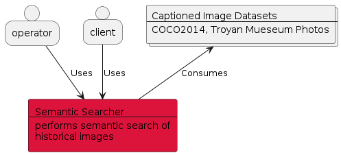
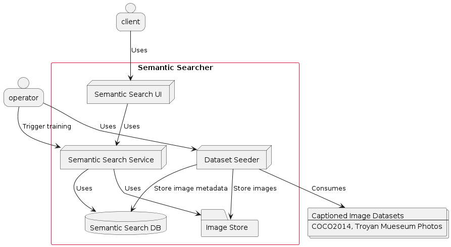
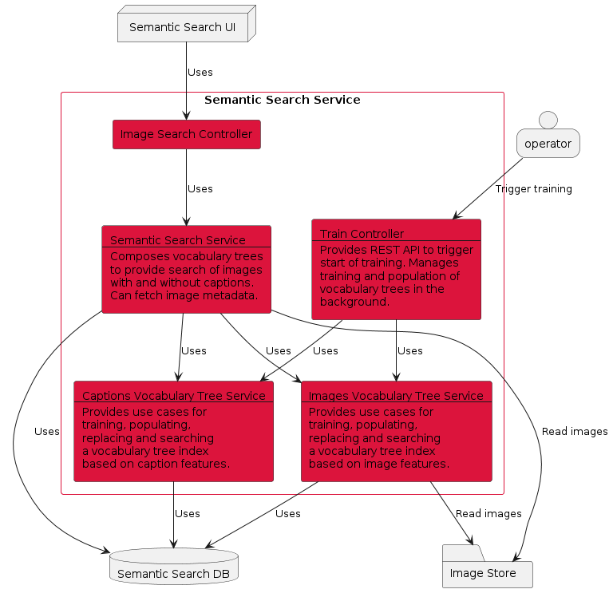
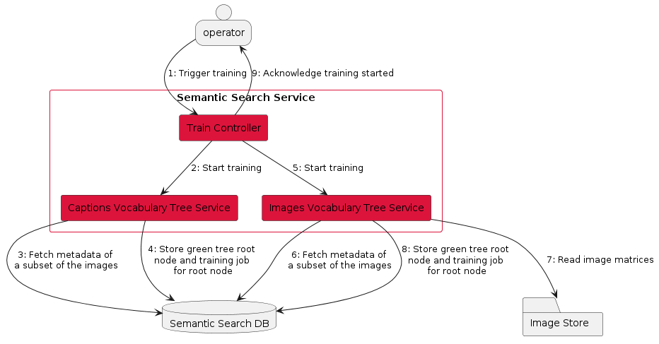
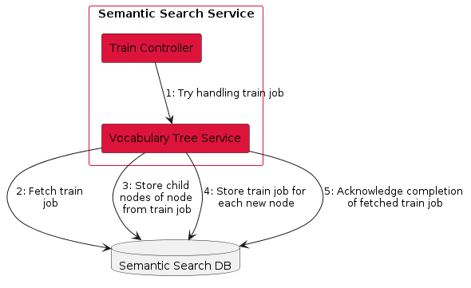
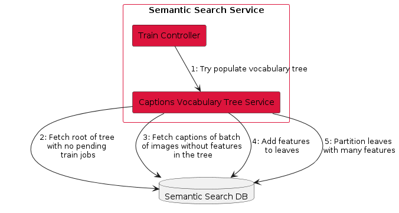
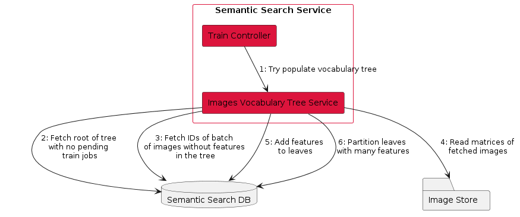
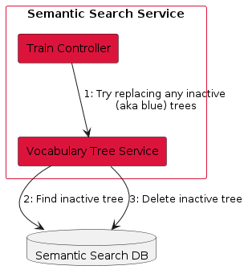
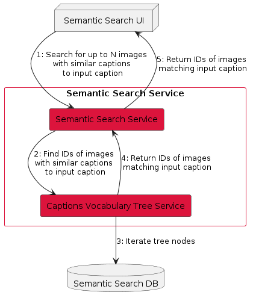
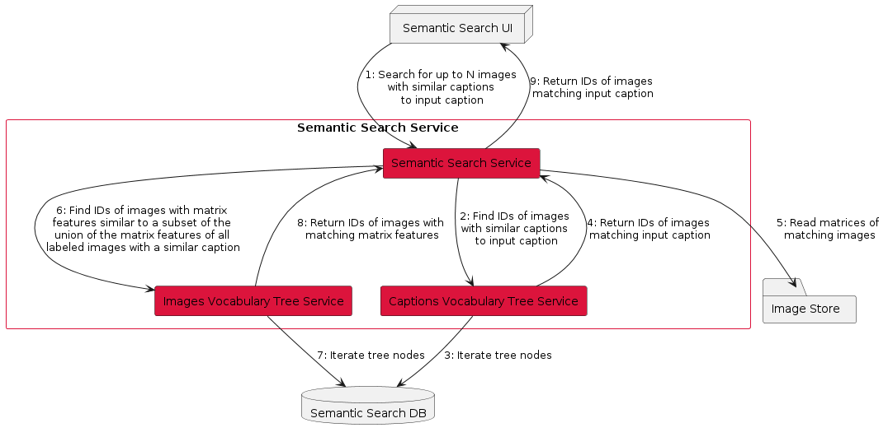

# C4 diagram of Semantic Search product

See https://c4model.com/.

## Context diagram

## Container diagram

## Component diagram

## Dynamic diagrams

### Start training

### Handle training job

### Populate vocabulary trees

Workflow for iterative population of the captions vocabulary tree.

Workflow for iterative population of the images vocabulary tree.

### Deprecate vocabulary tree

### Semantic search only of captioned (aka labeled) images

### Semantic search of all (including without captions) images

